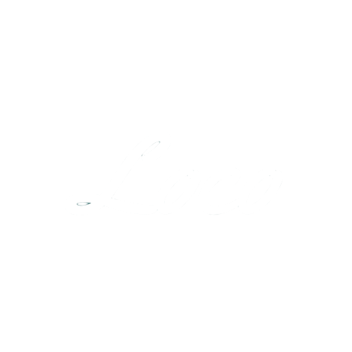

# My Graduation Project 🎓

<h1>Loco is An Ai local brands platform 🤖</h1>

A platform for Egyptian local brands where they can be found easily on one app instead of searching for them on Instagram. That will ease the seller and buyer process. In addition to the AI features that the app has.

Problems Solved
<ul>
    <li>Dollar paying problem in Egypt </li>
    <li>Finding brands in Instagram</li>
    <li>Digital marketing problems</li>
    <li>Gather brands in one place,easing on client and brand</li>
    <li>Marketing products with low cost packages</li>
    <li>Technical Support</li>
</ul>
Features
<ul>
    <li>AI Assistant</li>
    <li>Color picker</li>
    <li>Friendly UI</li>
    <li>Search for products</li>
    <li>History of payment</li>    
    <li>Variety of packages</li>
    <li>Dark & Light Theme based on system</li>
</ul>